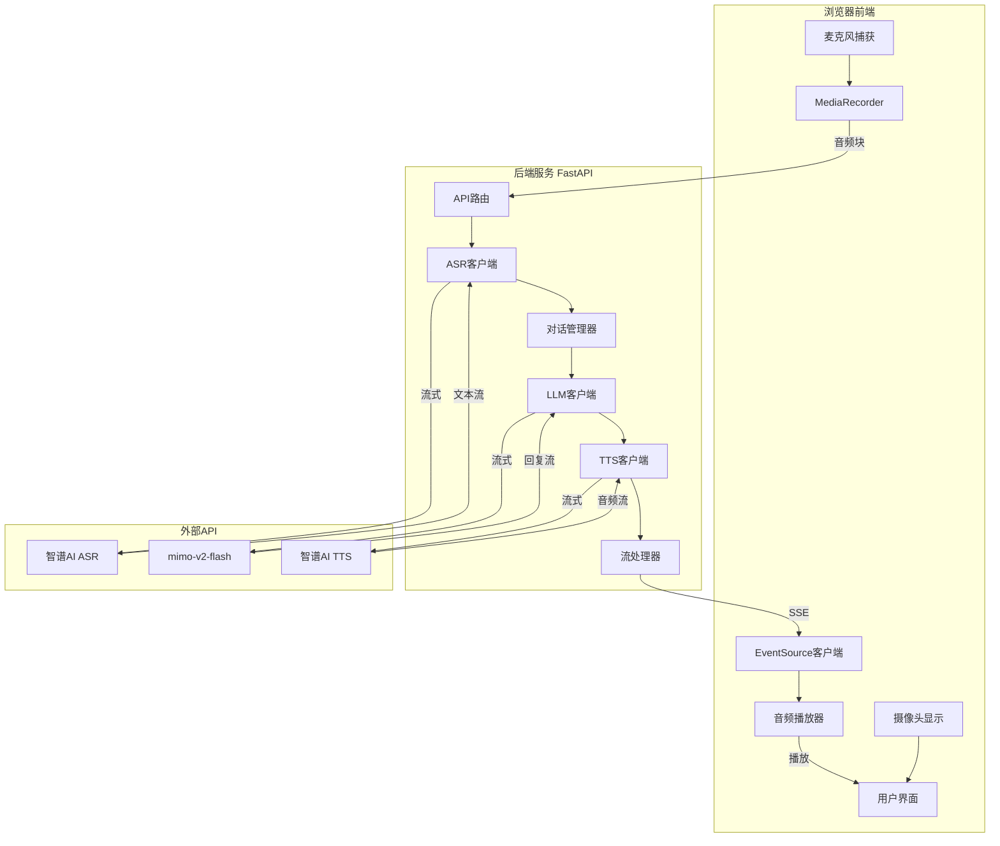

# 设计文档

## 概述

AI语音对话系统是一个基于Web的实时交互应用，采用流式架构实现低延迟的语音对话体验。系统由前端Web应用和后端Python服务组成，通过WebRTC捕获音视频，使用Server-Sent Events (SSE)实现流式数据传输，集成智谱AI和mimo-v2-flash API提供语音识别、对话生成和语音合成能力。

### 技术栈

**前端**:
- HTML5 + CSS3 + JavaScript (原生)
- WebRTC API (getUserMedia, MediaRecorder)
- EventSource API (SSE客户端)
- Web Audio API (音频播放)

**后端**:
- Python 3.x (在talk_demo_env conda环境中)
- FastAPI (异步Web框架)
- httpx (异步HTTP客户端)
- asyncio (异步流处理)

**外部服务**:
- 智谱AI ASR API (glm-asr-2512)
- mimo-v2-flash LLM API
- 智谱AI TTS API (glm-tts)

## 架构

### 系统架构图



### 数据流

1. **音频捕获流**: 麦克风 → MediaRecorder → 音频块(Blob) → 后端
2. **语音识别流**: 音频文件 → ASR API → 文本流 → 对话管理器
3. **对话生成流**: 用户文本 → LLM API → 回复文本流 → TTS客户端
4. **语音合成流**: 文本流 → TTS API → PCM音频流(base64) → 前端
5. **音频播放流**: base64音频 → 解码 → AudioContext → 扬声器

## 组件和接口

### 前端组件

#### 1. UIController
**职责**: 管理用户界面和状态显示

**接口**:
```javascript
class UIController {
  constructor()
  init()  // 初始化UI元素
  showState(state)  // 显示状态: 'idle', 'listening', 'thinking', 'speaking'
  showError(message)  // 显示错误信息
  updateTranscript(text)  // 更新识别文本
  updateAIResponse(text)  // 更新AI回复
}
```

#### 2. MediaCaptureManager
**职责**: 管理摄像头和麦克风访问

**接口**:
```javascript
class MediaCaptureManager {
  constructor()
  async requestPermissions()  // 请求权限
  async startVideoStream(videoElement)  // 启动视频流
  async startAudioRecording()  // 开始录音
  stopAudioRecording()  // 停止录音
  getAudioBlob()  // 获取录音数据
}
```

**实现细节**:
- 使用 `navigator.mediaDevices.getUserMedia()` 获取音视频流
- MediaRecorder配置: `mimeType: 'audio/webm'`, `audioBitsPerSecond: 16000`
- 使用 `dataavailable` 事件收集音频块
- 支持语音活动检测(VAD)判断用户何时停止说话

#### 3. ConversationClient
**职责**: 与后端通信，管理对话流程

**接口**:
```javascript
class ConversationClient {
  constructor(baseURL)
  async sendAudio(audioBlob)  // 发送音频到后端
  startListening(onMessage, onError)  // 开始监听SSE流
  stopListening()  // 停止监听
}
```

**实现细节**:
- 使用 `fetch()` POST音频数据到 `/api/conversation/audio`
- 使用 `EventSource` 连接到 `/api/conversation/stream`
- 处理SSE事件类型: `transcript`, `response`, `audio`, `error`, `done`

#### 4. AudioStreamPlayer
**职责**: 流式播放TTS音频

**接口**:
```javascript
class AudioStreamPlayer {
  constructor()
  async init()  // 初始化AudioContext
  playChunk(base64Audio, sampleRate)  // 播放音频块
  stop()  // 停止播放
  isPlaying()  // 是否正在播放
}
```

**实现细节**:
- 使用Web Audio API的AudioContext
- 解码base64 PCM数据为AudioBuffer
- 使用AudioBufferSourceNode流式播放
- 维护播放队列确保连续播放

### 后端组件

#### 1. FastAPI应用
**职责**: HTTP服务器和路由

**端点**:
```python
POST /api/conversation/audio
  - 接收音频文件
  - 返回会话ID

GET /api/conversation/stream?session_id={id}
  - SSE流式端点
  - 返回对话事件流

POST /api/conversation/start
  - 启动新对话
  - AI主动提问

GET /health
  - 健康检查
```

#### 2. ConversationManager
**职责**: 管理对话状态和流程

**接口**:
```python
class ConversationManager:
    def __init__(self, asr_client, llm_client, tts_client)
    
    async def create_session(self) -> str
    
    async def process_audio(
        self, 
        session_id: str, 
        audio_data: bytes
    ) -> AsyncGenerator[ConversationEvent, None]
    
    async def start_conversation(
        self, 
        session_id: str
    ) -> AsyncGenerator[ConversationEvent, None]
    
    def get_conversation_history(self, session_id: str) -> List[Message]
```

**实现细节**:
- 维护会话字典存储对话历史
- 使用UUID生成会话ID
- 协调ASR、LLM、TTS的流式调用
- 实现状态机: IDLE → LISTENING → PROCESSING → SPEAKING → IDLE

#### 3. ASRClient
**职责**: 调用智谱AI语音识别API

**接口**:
```python
class ASRClient:
    def __init__(self, api_key: str, base_url: str)
    
    async def transcribe_stream(
        self, 
        audio_file: bytes
    ) -> AsyncGenerator[str, None]
```

**实现细节**:
- 使用httpx异步客户端
- 发送multipart/form-data请求
- 参数: `model='glm-asr-2512'`, `stream=True`
- 解析SSE响应流，提取文本片段

#### 4. LLMClient
**职责**: 调用mimo-v2-flash对话API

**接口**:
```python
class LLMClient:
    def __init__(self, api_key: str, base_url: str, model: str)
    
    async def chat_stream(
        self, 
        messages: List[Dict[str, str]]
    ) -> AsyncGenerator[str, None]
```

**实现细节**:
- 使用OpenAI兼容的API格式
- 参数: `model='mimo-v2-flash'`, `stream=True`
- 维护对话历史上下文
- 解析流式响应，提取delta内容

#### 5. TTSClient
**职责**: 调用智谱AI语音合成API

**接口**:
```python
class TTSClient:
    def __init__(self, api_key: str, base_url: str)
    
    async def synthesize_stream(
        self, 
        text: str,
        voice: str = 'female',
        speed: float = 1.0,
        volume: float = 1.0
    ) -> AsyncGenerator[AudioChunk, None]
```

**实现细节**:
- 参数: `model='glm-tts'`, `stream=True`, `response_format='pcm'`, `encode_format='base64'`
- 解析SSE响应，提取base64音频和采样率
- 返回AudioChunk对象包含音频数据和元数据

#### 6. StreamProcessor
**职责**: 处理和转发流式事件

**接口**:
```python
class StreamProcessor:
    @staticmethod
    async def merge_streams(
        *streams: AsyncGenerator
    ) -> AsyncGenerator[ConversationEvent, None]
    
    @staticmethod
    def format_sse_event(event: ConversationEvent) -> str
```

**实现细节**:
- 合并多个异步生成器
- 格式化SSE事件: `event: {type}\ndata: {json}\n\n`
- 处理错误和完成事件

## 数据模型

### 前端数据模型

```javascript
// 对话状态
const ConversationState = {
  IDLE: 'idle',
  LISTENING: 'listening',
  PROCESSING: 'processing',
  SPEAKING: 'speaking'
}

// SSE事件
interface SSEEvent {
  type: 'transcript' | 'response' | 'audio' | 'error' | 'done'
  data: {
    text?: string
    audio?: string
    sample_rate?: number
    message?: string
  }
}
```

### 后端数据模型

```python
from pydantic import BaseModel
from typing import List, Optional
from enum import Enum

class MessageRole(str, Enum):
    USER = "user"
    ASSISTANT = "assistant"
    SYSTEM = "system"

class Message(BaseModel):
    role: MessageRole
    content: str
    timestamp: float

class ConversationSession(BaseModel):
    session_id: str
    messages: List[Message]
    created_at: float
    last_activity: float

class AudioChunk(BaseModel):
    audio_data: str  # base64编码
    sample_rate: int
    index: int

class ConversationEventType(str, Enum):
    TRANSCRIPT = "transcript"
    RESPONSE = "response"
    AUDIO = "audio"
    ERROR = "error"
    DONE = "done"

class ConversationEvent(BaseModel):
    type: ConversationEventType
    data: dict
    session_id: str
```

### API配置模型

```python
class APIConfig(BaseModel):
    # LLM配置
    llm_api_key: str = "sk-ciz7a6jhvu8btggkxoamhhf5jg73gysafg18lcnbc77hnosw"
    llm_base_url: str = "https://api.xiaomimimo.com/v1"
    llm_model: str = "mimo-v2-flash"
    
    # 智谱AI配置
    zhipu_api_key: str = "a17f862b12a84fcaa4943d0b8be647ad.awVQf0syosd4YQjK"
    zhipu_base_url: str = "https://open.bigmodel.cn/api/paas/v4"
    
    # ASR配置
    asr_model: str = "glm-asr-2512"
    asr_stream: bool = True
    
    # TTS配置
    tts_model: str = "glm-tts"
    tts_voice: str = "female"
    tts_speed: float = 1.0
    tts_volume: float = 1.0
    tts_response_format: str = "pcm"
    tts_encode_format: str = "base64"
    tts_stream: bool = True
```


## 正确性属性

*正确性属性是系统在所有有效执行中应保持为真的特征或行为——本质上是关于系统应该做什么的形式化陈述。属性作为人类可读规范和机器可验证正确性保证之间的桥梁。*

### Property 1: ASR流式响应解析正确性
*For any* 有效的ASR API流式响应，解析器应该能够正确提取所有文本片段，且解析后的文本拼接结果与完整响应中的文本内容一致
**Validates: Requirements 3.2, 3.4**

### Property 2: LLM流式响应处理正确性
*For any* 有效的LLM API流式响应，客户端应该能够正确解析每个delta内容，且所有delta内容拼接后等于完整的回复文本
**Validates: Requirements 4.1, 4.2**

### Property 3: 对话历史一致性
*For any* 对话会话，添加用户消息后再添加助手消息，对话历史应该按正确顺序包含所有消息，且消息内容不变
**Validates: Requirements 4.3**

### Property 4: TTS流式响应解析正确性
*For any* 有效的TTS API流式响应，解析器应该能够正确提取所有base64编码的音频块和采样率信息
**Validates: Requirements 5.1**

### Property 5: 对话状态机有效性
*For any* 对话状态和事件组合，状态机应该只允许有效的状态转换（IDLE→LISTENING→PROCESSING→SPEAKING→IDLE），且打断事件应该能从SPEAKING状态返回LISTENING状态
**Validates: Requirements 5.5, 6.2, 6.3, 6.5**

### Property 6: 流式数据传递完整性
*For any* 流式数据源产生的数据块序列，流处理器应该按顺序传递所有数据块给下游，不丢失任何数据
**Validates: Requirements 7.2**

### Property 7: 错误处理一致性
*For any* API调用错误，系统应该生成包含错误类型和描述的错误消息，且错误应该被记录到日志
**Validates: Requirements 8.1, 8.4**

### Property 8: API配置正确性
*For any* API请求，请求参数应该包含stream=true，且TTS请求应该包含正确的voice、speed、volume参数
**Validates: Requirements 9.5, 9.7**

### Property 9: API密钥安全性
*For any* 系统日志输出或HTTP响应，不应该包含完整的API密钥明文
**Validates: Requirements 9.4**

## 错误处理

### 错误类型

```python
class ErrorType(str, Enum):
    PERMISSION_DENIED = "permission_denied"  # 用户拒绝权限
    DEVICE_NOT_FOUND = "device_not_found"    # 设备不可用
    NETWORK_ERROR = "network_error"          # 网络错误
    ASR_ERROR = "asr_error"                  # 语音识别错误
    LLM_ERROR = "llm_error"                  # LLM调用错误
    TTS_ERROR = "tts_error"                  # TTS调用错误
    AUDIO_PLAYBACK_ERROR = "audio_playback_error"  # 音频播放错误
    SESSION_ERROR = "session_error"          # 会话错误
    UNKNOWN_ERROR = "unknown_error"          # 未知错误
```

### 错误处理策略

| 错误类型 | 处理策略 | 用户提示 |
|---------|---------|---------|
| PERMISSION_DENIED | 显示授权指南 | "请在浏览器设置中允许访问摄像头和麦克风" |
| DEVICE_NOT_FOUND | 提示检查设备 | "未检测到摄像头或麦克风，请检查设备连接" |
| NETWORK_ERROR | 自动重试(3次) | "网络连接不稳定，正在重试..." |
| ASR_ERROR | 提示重新说话 | "抱歉，没有听清楚，请再说一次" |
| LLM_ERROR | 允许重试 | "AI服务暂时不可用，请稍后重试" |
| TTS_ERROR | 显示文本回复 | "语音合成失败，请查看文字回复" |
| AUDIO_PLAYBACK_ERROR | 静默降级 | 仅显示文字，不播放语音 |

### 重试机制

```python
class RetryConfig:
    max_retries: int = 3
    base_delay: float = 1.0  # 秒
    max_delay: float = 10.0  # 秒
    exponential_base: float = 2.0
```

## 测试策略

### 单元测试

单元测试用于验证具体示例和边界情况：

1. **API客户端测试**
   - 测试ASR客户端请求格式
   - 测试LLM客户端请求格式
   - 测试TTS客户端请求格式
   - 测试错误响应处理

2. **数据模型测试**
   - 测试Message序列化/反序列化
   - 测试ConversationEvent创建
   - 测试AudioChunk解码

3. **状态机测试**
   - 测试有效状态转换
   - 测试无效状态转换拒绝
   - 测试打断逻辑

### 属性测试

使用 `hypothesis` 库进行属性测试，每个属性测试运行至少100次迭代：

1. **Property 1测试**: ASR流式响应解析
   - 生成随机的SSE响应流
   - 验证解析结果的完整性

2. **Property 2测试**: LLM流式响应处理
   - 生成随机的流式delta响应
   - 验证拼接结果正确性

3. **Property 3测试**: 对话历史一致性
   - 生成随机消息序列
   - 验证历史记录完整性

4. **Property 4测试**: TTS流式响应解析
   - 生成随机的音频块响应
   - 验证解析结果正确性

5. **Property 5测试**: 状态机有效性
   - 生成随机状态和事件序列
   - 验证状态转换正确性

6. **Property 6测试**: 流式数据传递
   - 生成随机数据块序列
   - 验证传递完整性

7. **Property 7测试**: 错误处理
   - 生成随机错误类型
   - 验证错误消息和日志

8. **Property 8测试**: API配置
   - 生成随机配置参数
   - 验证请求参数正确性

9. **Property 9测试**: API密钥安全
   - 生成包含密钥的日志
   - 验证密钥被正确掩码

### 测试框架配置

```python
# pytest.ini
[pytest]
testpaths = tests
python_files = test_*.py
python_functions = test_*
asyncio_mode = auto

# hypothesis配置
hypothesis.settings.default.max_examples = 100
hypothesis.settings.default.deadline = None
```

### 测试目录结构

```
tests/
├── unit/
│   ├── test_asr_client.py
│   ├── test_llm_client.py
│   ├── test_tts_client.py
│   ├── test_conversation_manager.py
│   └── test_state_machine.py
├── property/
│   ├── test_asr_parsing.py
│   ├── test_llm_parsing.py
│   ├── test_tts_parsing.py
│   ├── test_conversation_history.py
│   ├── test_state_machine.py
│   ├── test_stream_processor.py
│   ├── test_error_handling.py
│   ├── test_api_config.py
│   └── test_api_key_security.py
└── conftest.py
```
